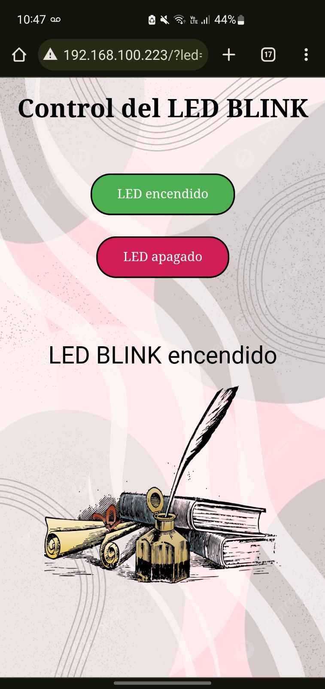
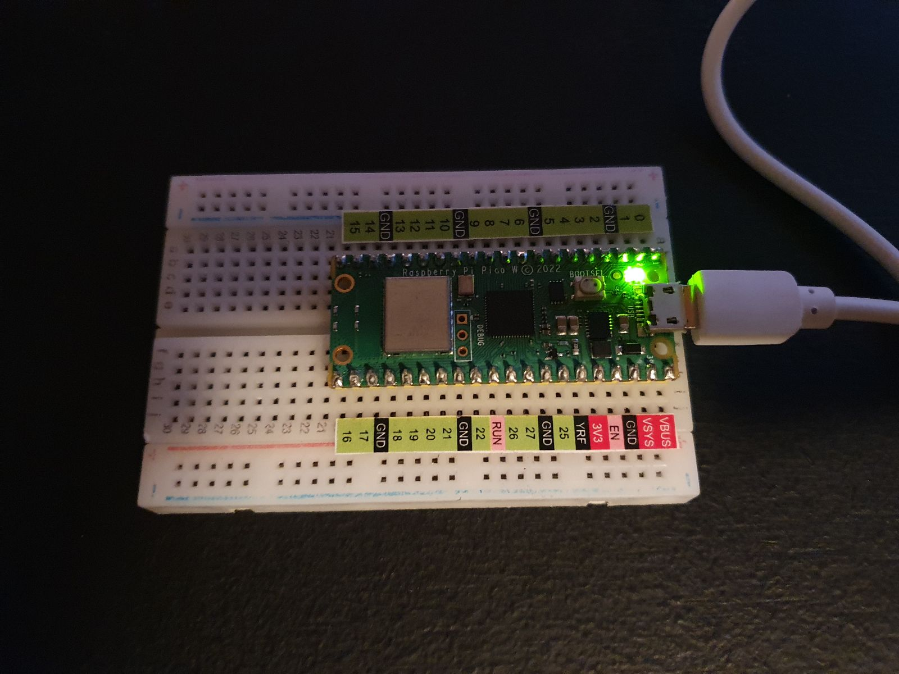
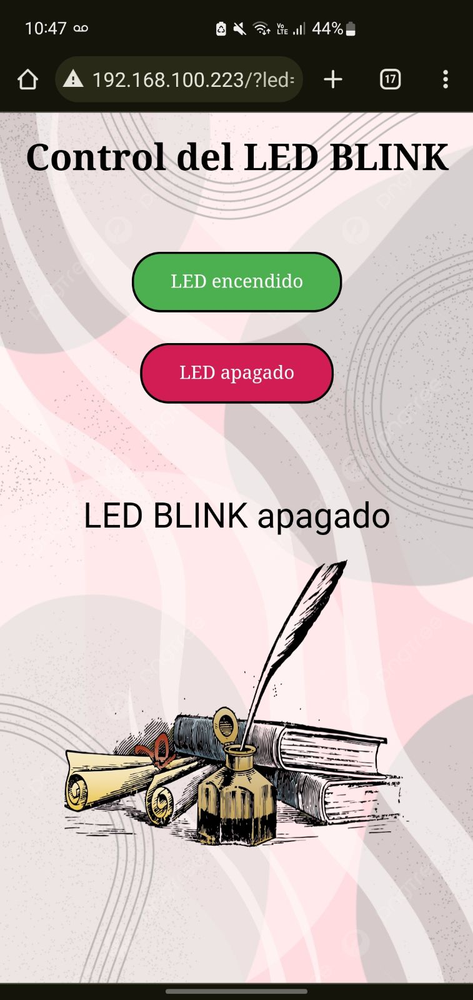
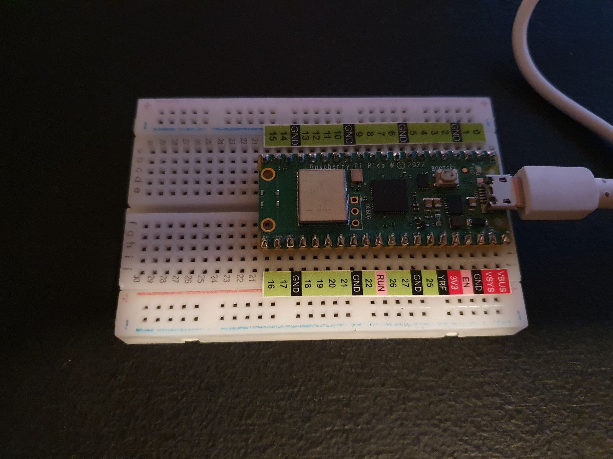

# Práctica-2.5

# 2.5 Embeded Web Server PicoW (prender / apagar BLINK Led Interno via WEB)
Depto de Sistemas y Computación  
Ing. En Sistemas Computacionales  
SISTEMAS PROGRAMABLES 23a  
Autor: Jesús Elías Martínez  
Fecha de entrega:   19/10/2023  
Objetivo: Crear un sitio web donde por medio de botones y conexión a internet desde la pico W, su led BLINK sea manipulado

**Código de thonny**   
Lenguaje: Phyton
```
#Elías Martínez Jesús      No. control: 20211768

#Importación de librerías
import time
import network
import socket
from machine import Pin

#Inicializar el led BLINK
led = machine.Pin("LED", machine.Pin.OUT)
#Iniciar con el estado del led
Estled = 'LED estado desconocido'

#Nombre de la red
Nombre_red = 'Totalplay-769E'
#Contraseña
Contra = '769E8C81pcTMPqyG'

#Envio de conexión
wlan = network.WLAN(network.STA_IF)
wlan.active(True)
wlan.connect(Nombre_red, Contra)

#Código HTML para el sitio web
html = """<!DOCTYPE html>
<html>
<head>
    <meta name="viewport" content="width=device-width, initial-scale=1">
    <link rel="icon" href="data:,">
    <style>
        html {
            font-family: "Times New Roman";
            display: inline-block;
            margin: 0px auto;
            text-align: center;
            background-image: url('https://png.pngtree.com/background/20210717/original/pngtree-grey-and-pink-color-background-for-mobile-wallpaper-picture-image_1440874.jpg'); 
            background-size: cover;
        }
        .btnEncendido, .btnApagado {
            background-color: #4CAF50;
            border: 2px solid #000000;
            color: white;
            padding: 15px 32px;
            text-align: center;
            text-decoration: none;
            display: inline-block;
            font-family: "Times New Roman";
            font-size: 16px;
            margin: 4px 2px;
            cursor: pointer;
            border-radius: 25px;
            font-weight: bold;
        }
        .btnApagado {
            background-color: #D11D53;
        }
        p {
            text-decoration: none;
            font-family: "MS Dialog";
            font-size: 30px;
            margin: 2px;
            cursor: pointer;
        }
        .imagen-centro  {
            text-align: center;
            background: transparent;
            margin-top: 20px;
        }
        .imagen-centro  img {
            border: none;
            width: 300px;
            height: 250px;
        }
    </style>
</head>
<body>
    <center>
        <h1>Control de LED BLINK</h1>
    </center><br><br>
    <form>
        <center>
            <center> <button class="btnEncendido" name="led" value="on" type="submit">LED encendido</button>
            <br><br>
            <center> <button class="btnApagado" name="led" value="off" type="submit">LED apagado</button>
        </center>
    </form>
    <br><br>
    <br><br>
    <p>%s<p>
    <div class="imagen-centro">
        
    </div>
</body>
</html>
"""

#Espera para la conexión
EsperaMax = 10
while EsperaMax > 0:
    if wlan.status() < 0 or wlan.status() >= 3:
        break
    EsperaMax -= 1
    print('Conectando...')
    time.sleep(1)
    
#Selectiva en caso de error en conexión
if wlan.status() != 3:
    raise RuntimeError('Conexión a la red fallida')
else:
    print('Conectado a WiF')
    status = wlan.ifconfig()
    print( 'ip = ' + status[0] )
    
    
#Se abre el socket
addr = socket.getaddrinfo('0.0.0.0', 80)[0][-1]
s = socket.socket()
s.bind(addr)
s.listen(1)
print('listening on', addr)

#Lista de conexiones
while True:
    try:       
        cl, addr = s.accept()
        print('Conectado de', addr)
        request = cl.recv(1024)
        print("Pedido:")
        print(request)
        request = str(request)
        led_on = request.find('led=on')
        led_off = request.find('led=off')
        
        print( 'led on = ' + str(led_on))
        print( 'led off = ' + str(led_off))
        
        if led_on == 8:
            print("led on")
            led.value(1)
        if led_off == 8:
            print("led off")
            led.value(0)
        
        Estled = "LED BLINK apagado" if led.value() == 0 else "LED BLINK encendido" #Cambia el estado del LED
        
        #El sitio se hace responsivo
        stateis = Estled
        response = html % stateis
        cl.send('HTTP/1.0 200 OK\r\nContent-type: text/html\r\n\r\n')
        cl.send(response)
        cl.close()
        
    except OSError as e:
        cl.close()
        print('Conexión terminada') #Conexión terminada
```

**Resultados**  
_LED BLINK encendido_  
Sitio web  
  

Resultado en físico  
   

_LED BLINK apagado_  
Sitio web  
   

Resultado en físico  
  
